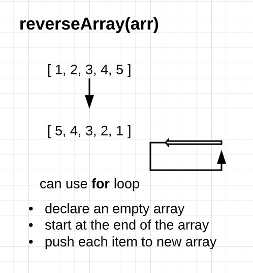
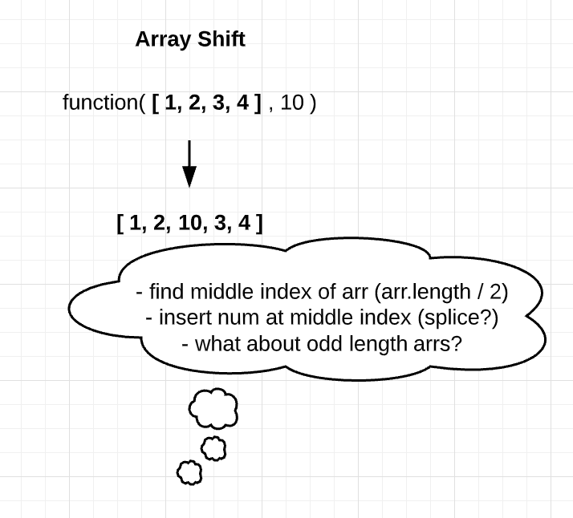
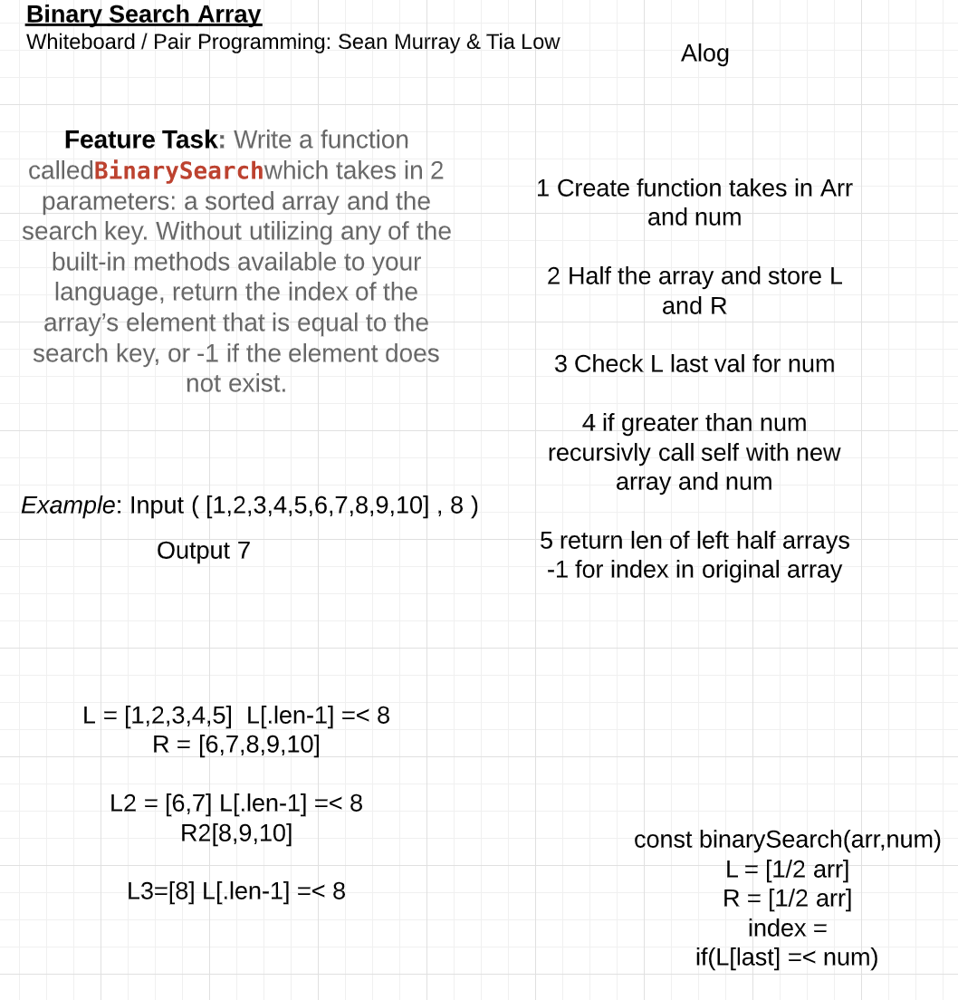
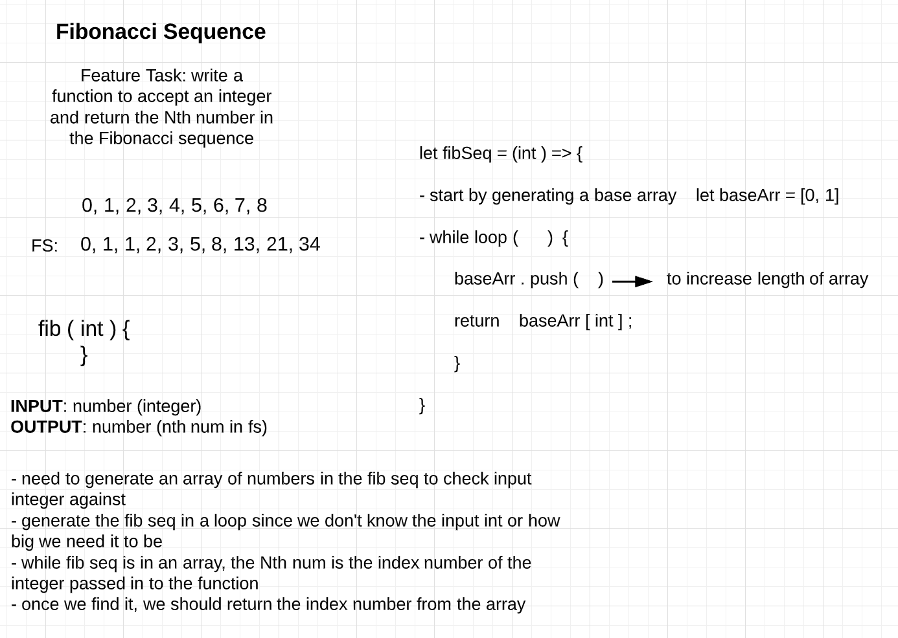
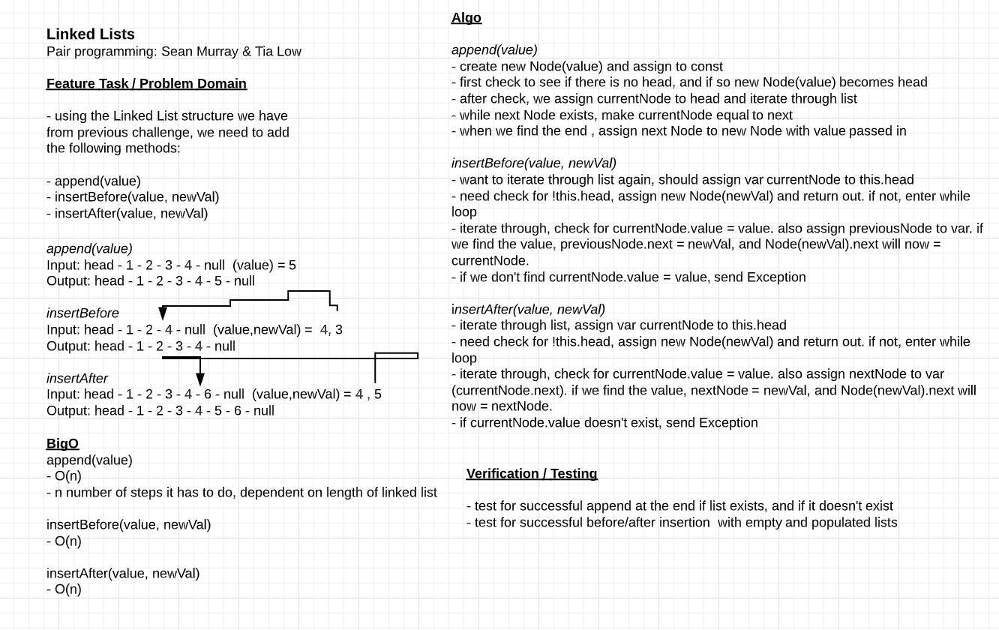
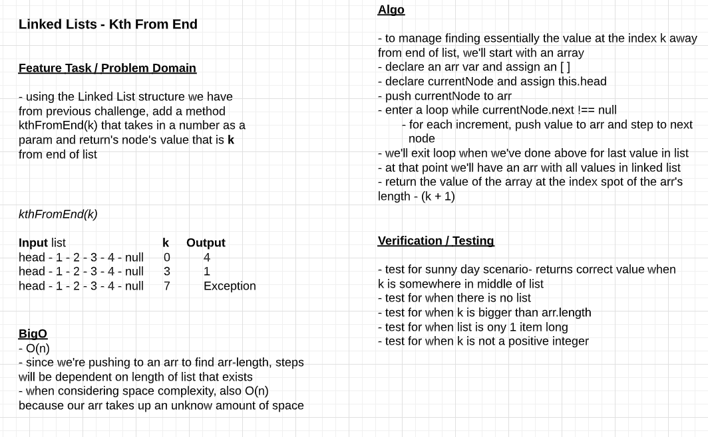
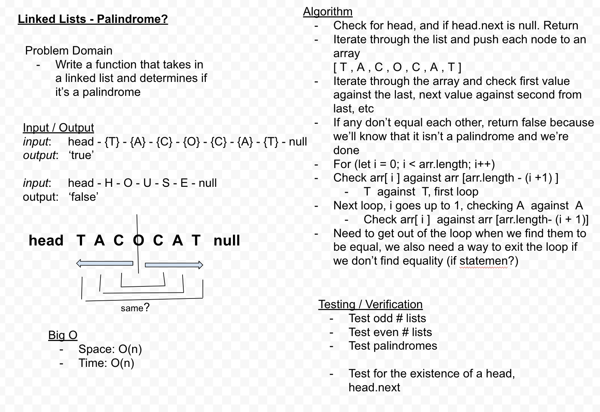
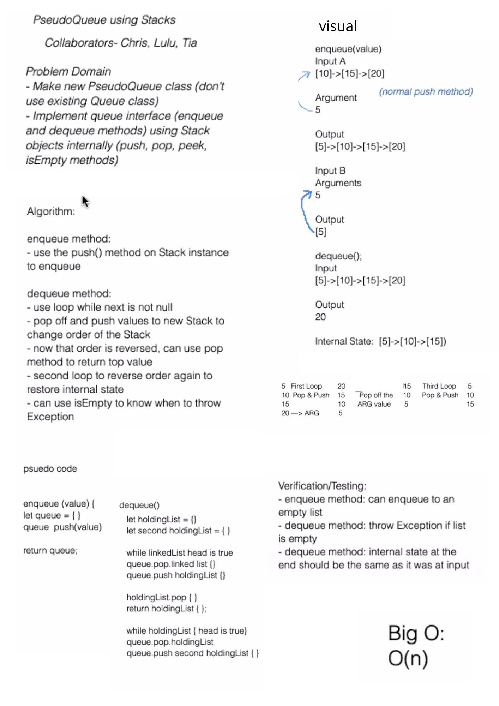

# Reverse an Array
- Class 01 : 08-10-2020

## Challenge
- The challenge is to reverse an array of any length without using any methods that are built in to JavaScript. 

## Approach & Efficiency
- My approach with solving this challenge was to start at the end of the array and work forward from there by decrementing the index. With each position we can push that value to the new array. By doing it this way, it will work with an array of any length. 

## Solution
[Solution Code](challenges/arrayReverse/array-reverse.js)

***

# Shift an Array
- Class 02 : 08-11-2020

## Challenge
- The challenge is to shift an array in that the function will take in an array and an individual number, and add that individual number to the middle of the existing array. 

## Approach & Efficiency
- My thought is to find the length of the array, divide it by two to find the middle, and *somehow* retrieve that index number and insert the value in front of it. 

## Solution
[Solution Code](challenges/arrayShift/array-shift.js)

***

# Binary Search
- Class 03 : 08-12-2020
- Collab with Sean Murray

## Challenge
- Write a function that takes in a sorted array and a number, finds the number in the array, and returns the index of the found number. If not in array

## Approach & Efficiency
- Our original approach, as seen in the whiteboard, was to break the arr into a left and right half and check against the length. The plan was to recursively call the function with each slice until getting it down to the solution. However once we started tinkering with the pseudo code and playing around with it a bit, we realized we didn't need to break it into halves. We just needed to move the search area in "halves". In this sense we found the start and end of a search area, and altered it each time we didn't find the number in that search area. 

## Solution
[Solution Code](challenges/arrayBinarySearch/array-binary-search.js)

***

# Mock Interview - Fibonacci Sequence
- Class 04 : 08-13-2020
- Mock Interview challenge with Daisy Johnson 

## Challenge
- Mock interview code challenge. I walked through my whiteboard process of the feature task with Daisy as my interviewer. The challenge was to work with the Fibonacci Sequence and write a function that takes in an integer and returns the nth number in the Fibonacci sequence. A new problem to me! 

## Approach & Efficiency
- After doing just a little bit of research on the Fibonacci sequence, I approached the problem from a very high level to start. The whiteboard below is as much as I got through in the 20-ish minutes of the mock interview. My approach was to first think about the sequence itself, and how it's represented with code. I decided it would be represented as numbers in an array, so we'd need to find the index of the number in the array since that is what would correspond to the nth position in the Fibonacci sequence. Since we don't know the exact integer being passed to the function, and consequently we don't know how long the sequence would need to be, my approach was to start with a beginning array of [ 0 , 1 ] and add to it in a while loop. We'd check the integer against the array and return the index of the integer in the array once found, and thus exiting the while loop.  

## Resources
- I had to do some research, this article helped immensely: https://medium.com/quick-code/fibonacci-sequence-javascript-interview-question-iterative-and-recursive-solutions-6a0346d24053

## Solution
[Solution Code](challenges/fibSeq/fibonacci-sequence.js)

***

# Data Structures - Linked List 
- Class 05 : 08-14-2020

## Challenge
- This challenge was to work with linked lists and create and Node and LinkedList class. Working with those two, the challenge was to do the following:
  - *insert* method that would take in a value and insert it to the head of the list
  - *includes* method that would take in a value and check to see if the linked list included it
  - *toString* method that would return a string representing all the value in the list

## Approach & Efficiency
- The approach was to create two separate classes, class Node and class LinkedList. The class Node would hold the value of the node and the refernce to the next node. The class LinkedList would hold reference to the head, and then the three methods decribed above. 

## API
- **insert** method
  - This method takes in a value and then assigns the head property to be a new instance of class node, passing it the value and this.head. On the first instantiation that corresponds to the next Node and it will be null, but in future instantiations the previous head node will be pass as the new this.next
- **includes** method
  - This method assigns the head Node to a variable of currentNode, and then runs a loop while the currentNode is not equal to null. The method takes in a value and while in the loop, checks the currentNode against the value. If it finds it, it will return true and continue incrementing through the list by assigning currentNode to currentNode.next. The loop will exit once we get through the last item in the linked list because at that point the currentNode will be null, and if it hasn't found the value within the loop, it will return false. 
- **toString** method
  - Similar to *includes*, this method will traverse through the linked list. It does not take in any arguments, but instead assigns a beginning variable to an empty string. We enter a loop while the currentNode is not equal to null, and as we increment through the linked list we add the value of the currentNode to the empty string. We also use a template literal to add the exact format desired. Once we reach the end of the linked list we exit the loop, and return the resulting string in a template literal to add "null" to signify the end of the list, and see it's contents in visual form. 

## Solution
[Solution Code](data-structures/linked-list/linked-list.js)
***
***

# Linked List - Insertions
- Class 06 : 08-17-2020
- Collab with Sean Murray

## Challenge
- This challenge builds upon the previous Linked List challenge, extending the class to include the following methods:
  - *append* method that will take in a value and add a new node with the given value to the end of the list
  - *insertBefore* method that will take in a value and a new value (newVal) and add a new node with the given newVal immedietely **before** the first value node
  - *insertAfter* method that will also take in a value and a newVal and add a new node with given newVal immedietely **after** the first value node

## Approach & Efficiency
- The approach is to build upon the previous Linked List class. For the *append* method the approach will be to check and see if a head already exists. If not, we'll instantiate a new Node with the value passed into the method. If a head already exists, we'll want to traverse through the list in a while loop until the value of the next node is null, in which we'll append the new Node with value passed in. 
- For the *insertBefore* method, the approach will be to again figure out if a head exists. If not we can just instantiate a new node with the newVal passed in to the function. If one does exist, we'll want to traverse the list looking for the spot where the value of the current node equals the value passed in to the function. If it exists, we will change the current node to the the next node, and reassign the current node variable to newVal. If the value does not exist, we will throw an exception. 
- The *insertAfter* method will be similar in checking for a head and entering a while loop if it exists. We'll look for the node with the value passed in to the method, and if it exists we will instantiate a new node with newVal passed in to the function. If it doesn't exist, we'll again throw an exception. 

## Solution
[Solution Code](data-structures/linked-list/linked-list.js)

***

# Linked List - Kth Value from End
- Class 07 : 08-18-2020
- Individual challenge (partner wasn't available)

## Challenge
- This challenge builds upon the previous Linked List challenge, extending the class to include the following method:
  - *kth from end*: should take in a number parameter *k* and find the value that corresponds to the kth place away from the end of the list. For example, kthFromEnd(2) would find that value of the list node that is 2 away from the end of the list. 

## Approach & Efficiency
- The approach is to build upon the previous Linked List class. For the *kth from end* method I will build an array with the values of the nodes in the linked list. I would like to first account for the scenarios where an error should be thrown:
  - if k is larger than the number of nodes in the list
  - if k is equal to the number of nodes in the list
  - if k is a negative number
- After ruling out the situations that would cause an error, we will declare a variable and assign it the length of the array *minus* k+1. We need to account for the +1 since the position closest to the end is considered 0. 
- At this point we'll just need to return the value of the array at the index position declared above. 
## Solution
[Solution Code](data-structures/linked-list/linked-list.js)

***

# Linked List - Zip Two Lists
- Class 08 : 08-19-2020
- Individual challenge (partner wasn't available)

## Challenge
- This challenge was to write a function that takes in two linked lists, and then "zips them up" so that the resulting lists is a combined one that alternates between the list 1 and list 2 values. We should try to keep the additional space down to O(1).

## Approach & Efficiency
- The approach here is to envision two lists, a top one and a bottom one. We'll want to make sure and assign the head of both lists so that we can traverse through each of them. The trick here is that we don't want to lose the references 

## Solution
[Solution Code](challenges/ll_zip/ll-zip.js)
![Linked List Zi[]](challenges/whiteboards/ll-zip.png)
***

# Mock Interview - Linked List Palindrome
- Class 09 : 08-20-2020
- Mock Interview challenge with Daisy Johnson 

## Challenge
- Mock interview code challenge. I walked through my whiteboard process of the feature task with Daisy as my interviewer. The challenge was to take in a singly linked list and determine if it's a plaindrome or not. Return true if palindrome, return false if not. 

## Approach & Efficiency
- My approach was to push each item of the linked list to an array. Now we have an array to evaluate. We want to think about the middle of the array, and comparing the first item in the array to the last item in the array. Next item in the array to the second from last item in the array, and etc. We'll use a loop to go through the length of the array and compare the left to the right side. If we find equality, we'll return true and that will need to get us out of the loop so we'll need everything in an if statement. 

## Solution
[Solution Code](data-structures/linked-list/ll-palindrome.js)

***

# Data Structures - Stack & Queue
- Class 10 : 08-21-2020
- Independent code challenge

## Challenge
- The data structure today was focused around Stacks and Queues. The challenge was to write a class for each and methods to use on the class, assuming we are working with linked lists.

## Approach & Efficiency
- The approach was to create a Node class that would hold the value and reference to next. Both Stack and Queue classes would use Node, and would have their own constructors and methods. 

## API
**Stack**
- *push* method: this method takes in a value and creates a new Node with that value, adding it to the top of the stack. It also increments the length property of the Stack.
- *pop* method: this method does not take any parameters, but removes the Node from the top of the stack. It returns the Node's value. If the stack is empty, it will raise an exception. The trick here is to use a temporary variable to hold on to the value of the removed node the references to next are switched. If a Node is popped from the stack, the length property of Stack decrements. 
- *peek* method: this method also does not take any parameters but returns the value of the Node that is at the top of the stack. It does not remove the Node, and will raise an exception when the method is called on an empty stack. 
- *isEmpty* method: this method checks the length property of the Stack, and returns the boolean true if it is empty.

**Queue**
- *enqueue* method: this method instantiates a new Node and adds it to the (back) of the queue.It first checks if the queue is empty and if so, adds the Node and increments the length property. If there is already a queue, the method will traverse backwards through the queue to find the point where there is no reference to next. At the point we will add the new Node and increment the length.
- *dequeue* method: removes a Node from the front of the queue and returns the Node's value. Again we'll have to make sure and store the front Node in a temp variable to be able to sever its reference to next and return the value of it later. If the queue is empty when the method is called, it will throw and exception.
- *peek* method:this method returns the value of the Node located at the front of the queue, without removing it. The method will throw and exception when called on an empty queue. 
- *isEmpty* method: checks the length property of the queue and returns the boolean true if it is 0.

## Solution
[Solution Code](data-structures/stacksAndQueues/stacks-and-queues.js)
***
***

# Stacks with Queues 
- Class 11 : 08-24-2020
- Collabs: Lulu Sevignon & Chris Hamersly 

## Challenge
- The challenge today is to create a brand new PseudoQueue class that does not use the existing Queue class (from class 10). This new PseudoQueue class will implement our standard queue interface- enqueue(value) and dequeue()- but will only internally utilize two Stack objects. Stack instances have push, pop, peek, and isEmpty methods as before. 

## Approach & Efficiency
- For the *enqueue* method, our approach is to use the push method on an instance of a Stack. 
- For the *dequeue* method, the approach is to first use a loop to reverse the order of the Stack, but pushing it to a new Stack. Once the order is reversed, we can pop our desired value off the top of the stack and return the value. Then we'll want to use another loop to reverse the order again, to restore the internal state back to it was at the input stage. If the list is empty, we'll want to throw an Exception. 

## Solution
[Solution Code](challenges/queuesWithStacks/queue-with-stacks.js)

***

# TITLE 
- Class 12 : 08-25-2020
- Collabs: 

## Challenge
- 

## Approach & Efficiency
- 

## Solution
[Solution Code](challenges/ / .js)

***