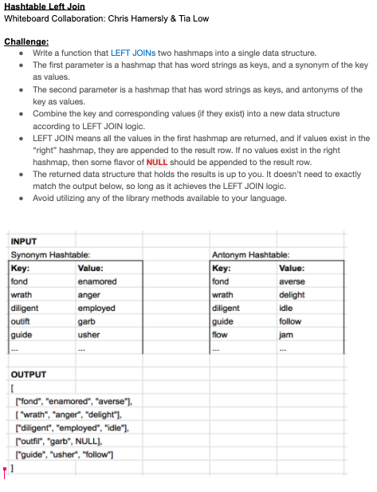
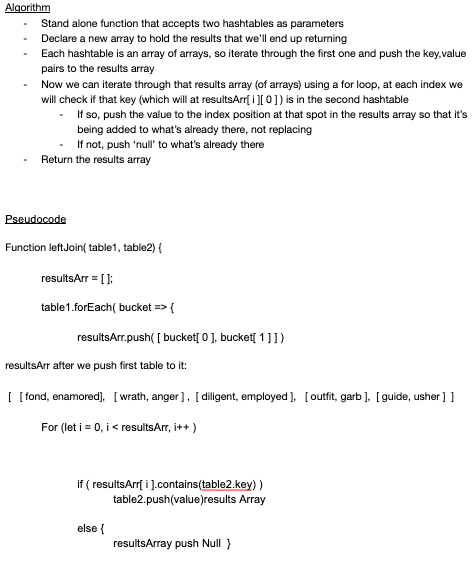
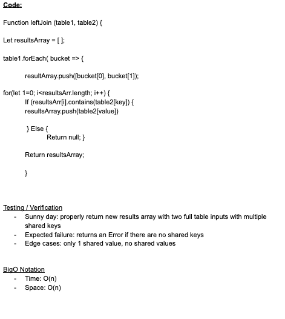
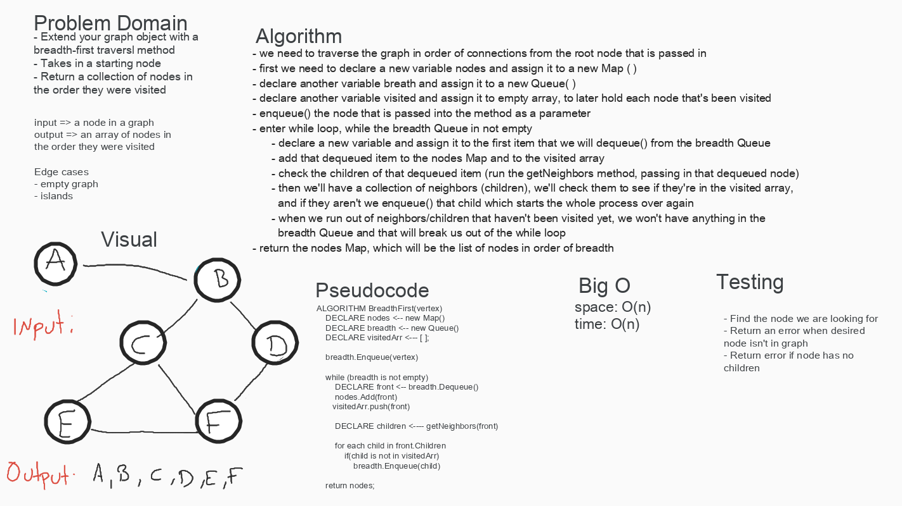
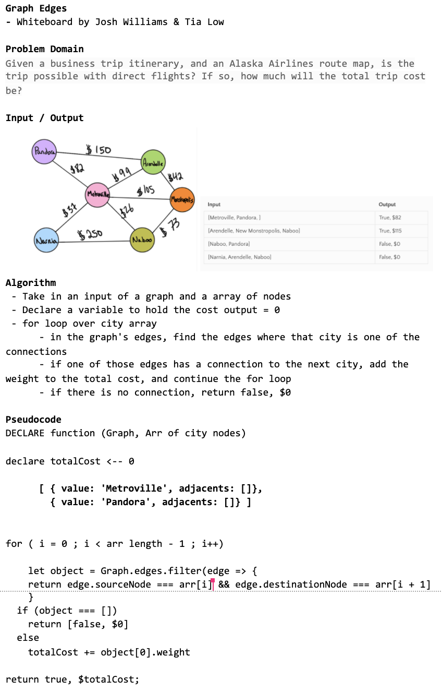
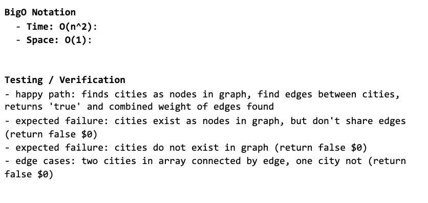

# Reverse an Array
- Class 01 : 08-10-2020

## Challenge
- The challenge is to reverse an array of any length without using any methods that are built in to JavaScript. 

## Approach & Efficiency
- My approach with solving this challenge was to start at the end of the array and work forward from there by decrementing the index. With each position we can push that value to the new array. By doing it this way, it will work with an array of any length. 

## Solution
[Solution Code](challenges/arrayReverse/array-reverse.js)

***

# Shift an Array
- Class 02 : 08-11-2020

## Challenge
- The challenge is to shift an array in that the function will take in an array and an individual number, and add that individual number to the middle of the existing array. 

## Approach & Efficiency
- My thought is to find the length of the array, divide it by two to find the middle, and *somehow* retrieve that index number and insert the value in front of it. 

## Solution
[Solution Code](challenges/arrayShift/array-shift.js)

***

# Binary Search
- Class 03 : 08-12-2020
- Collab with Sean Murray

## Challenge
- Write a function that takes in a sorted array and a number, finds the number in the array, and returns the index of the found number. If not in array

## Approach & Efficiency
- Our original approach, as seen in the whiteboard, was to break the arr into a left and right half and check against the length. The plan was to recursively call the function with each slice until getting it down to the solution. However once we started tinkering with the pseudo code and playing around with it a bit, we realized we didn't need to break it into halves. We just needed to move the search area in "halves". In this sense we found the start and end of a search area, and altered it each time we didn't find the number in that search area. 

## Solution
[Solution Code](challenges/arrayBinarySearch/array-binary-search.js)

***

# Mock Interview - Fibonacci Sequence
- Class 04 : 08-13-2020
- Mock Interview challenge with Daisy Johnson 

## Challenge
- Mock interview code challenge. I walked through my whiteboard process of the feature task with Daisy as my interviewer. The challenge was to work with the Fibonacci Sequence and write a function that takes in an integer and returns the nth number in the Fibonacci sequence. A new problem to me! 

## Approach & Efficiency
- After doing just a little bit of research on the Fibonacci sequence, I approached the problem from a very high level to start. The whiteboard below is as much as I got through in the 20-ish minutes of the mock interview. My approach was to first think about the sequence itself, and how it's represented with code. I decided it would be represented as numbers in an array, so we'd need to find the index of the number in the array since that is what would correspond to the nth position in the Fibonacci sequence. Since we don't know the exact integer being passed to the function, and consequently we don't know how long the sequence would need to be, my approach was to start with a beginning array of [ 0 , 1 ] and add to it in a while loop. We'd check the integer against the array and return the index of the integer in the array once found, and thus exiting the while loop.  

## Resources
- I had to do some research, this article helped immensely: https://medium.com/quick-code/fibonacci-sequence-javascript-interview-question-iterative-and-recursive-solutions-6a0346d24053

## Solution
[Solution Code](challenges/fibSeq/fibonacci-sequence.js)

***

# Data Structures - Linked List 
- Class 05 : 08-14-2020

## Challenge
- This challenge was to work with linked lists and create and Node and LinkedList class. Working with those two, the challenge was to do the following:
  - *insert* method that would take in a value and insert it to the head of the list
  - *includes* method that would take in a value and check to see if the linked list included it
  - *toString* method that would return a string representing all the value in the list

## Approach & Efficiency
- The approach was to create two separate classes, class Node and class LinkedList. The class Node would hold the value of the node and the refernce to the next node. The class LinkedList would hold reference to the head, and then the three methods decribed above. 

## API
- **insert** method
  - This method takes in a value and then assigns the head property to be a new instance of class node, passing it the value and this.head. On the first instantiation that corresponds to the next Node and it will be null, but in future instantiations the previous head node will be pass as the new this.next
- **includes** method
  - This method assigns the head Node to a variable of currentNode, and then runs a loop while the currentNode is not equal to null. The method takes in a value and while in the loop, checks the currentNode against the value. If it finds it, it will return true and continue incrementing through the list by assigning currentNode to currentNode.next. The loop will exit once we get through the last item in the linked list because at that point the currentNode will be null, and if it hasn't found the value within the loop, it will return false. 
- **toString** method
  - Similar to *includes*, this method will traverse through the linked list. It does not take in any arguments, but instead assigns a beginning variable to an empty string. We enter a loop while the currentNode is not equal to null, and as we increment through the linked list we add the value of the currentNode to the empty string. We also use a template literal to add the exact format desired. Once we reach the end of the linked list we exit the loop, and return the resulting string in a template literal to add "null" to signify the end of the list, and see it's contents in visual form. 

## Solution
[Solution Code](data-structures/linked-list/linked-list.js)
***
***

# Linked List - Insertions
- Class 06 : 08-17-2020
- Collab with Sean Murray

## Challenge
- This challenge builds upon the previous Linked List challenge, extending the class to include the following methods:
  - *append* method that will take in a value and add a new node with the given value to the end of the list
  - *insertBefore* method that will take in a value and a new value (newVal) and add a new node with the given newVal immedietely **before** the first value node
  - *insertAfter* method that will also take in a value and a newVal and add a new node with given newVal immedietely **after** the first value node

## Approach & Efficiency
- The approach is to build upon the previous Linked List class. For the *append* method the approach will be to check and see if a head already exists. If not, we'll instantiate a new Node with the value passed into the method. If a head already exists, we'll want to traverse through the list in a while loop until the value of the next node is null, in which we'll append the new Node with value passed in. 
- For the *insertBefore* method, the approach will be to again figure out if a head exists. If not we can just instantiate a new node with the newVal passed in to the function. If one does exist, we'll want to traverse the list looking for the spot where the value of the current node equals the value passed in to the function. If it exists, we will change the current node to the the next node, and reassign the current node variable to newVal. If the value does not exist, we will throw an exception. 
- The *insertAfter* method will be similar in checking for a head and entering a while loop if it exists. We'll look for the node with the value passed in to the method, and if it exists we will instantiate a new node with newVal passed in to the function. If it doesn't exist, we'll again throw an exception. 

## Solution
[Solution Code](data-structures/linked-list/linked-list.js)

***

# Linked List - Kth Value from End
- Class 07 : 08-18-2020
- Individual challenge (partner wasn't available)

## Challenge
- This challenge builds upon the previous Linked List challenge, extending the class to include the following method:
  - *kth from end*: should take in a number parameter *k* and find the value that corresponds to the kth place away from the end of the list. For example, kthFromEnd(2) would find that value of the list node that is 2 away from the end of the list. 

## Approach & Efficiency
- The approach is to build upon the previous Linked List class. For the *kth from end* method I will build an array with the values of the nodes in the linked list. I would like to first account for the scenarios where an error should be thrown:
  - if k is larger than the number of nodes in the list
  - if k is equal to the number of nodes in the list
  - if k is a negative number
- After ruling out the situations that would cause an error, we will declare a variable and assign it the length of the array *minus* k+1. We need to account for the +1 since the position closest to the end is considered 0. 
- At this point we'll just need to return the value of the array at the index position declared above. 
## Solution
[Solution Code](data-structures/linked-list/linked-list.js)

***

# Linked List - Zip Two Lists
- Class 08 : 08-19-2020
- Individual challenge (partner wasn't available)

## Challenge
- This challenge was to write a function that takes in two linked lists, and then "zips them up" so that the resulting lists is a combined one that alternates between the list 1 and list 2 values. We should try to keep the additional space down to O(1).

## Approach & Efficiency
- The approach here is to envision two lists, a top one and a bottom one. We'll want to make sure and assign the head of both lists so that we can traverse through each of them. The trick here is that we don't want to lose the references 

## Solution
[Solution Code](challenges/ll_zip/ll-zip.js)
![Linked List Zi[]](challenges/whiteboards/ll-zip.png)
***

# Mock Interview - Linked List Palindrome
- Class 09 : 08-20-2020
- Mock Interview challenge with Daisy Johnson 

## Challenge
- Mock interview code challenge. I walked through my whiteboard process of the feature task with Daisy as my interviewer. The challenge was to take in a singly linked list and determine if it's a plaindrome or not. Return true if palindrome, return false if not. 

## Approach & Efficiency
- My approach was to push each item of the linked list to an array. Now we have an array to evaluate. We want to think about the middle of the array, and comparing the first item in the array to the last item in the array. Next item in the array to the second from last item in the array, and etc. We'll use a loop to go through the length of the array and compare the left to the right side. If we find equality, we'll return true and that will need to get us out of the loop so we'll need everything in an if statement. 

## Solution
[Solution Code](data-structures/linked-list/ll-palindrome.js)

***

# Data Structures - Stack & Queue
- Class 10 : 08-21-2020
- Independent code challenge

## Challenge
- The data structure today was focused around Stacks and Queues. The challenge was to write a class for each and methods to use on the class, assuming we are working with linked lists.

## Approach & Efficiency
- The approach was to create a Node class that would hold the value and reference to next. Both Stack and Queue classes would use Node, and would have their own constructors and methods. 

## API
**Stack**
- *push* method: this method takes in a value and creates a new Node with that value, adding it to the top of the stack. It also increments the length property of the Stack.
- *pop* method: this method does not take any parameters, but removes the Node from the top of the stack. It returns the Node's value. If the stack is empty, it will raise an exception. The trick here is to use a temporary variable to hold on to the value of the removed node the references to next are switched. If a Node is popped from the stack, the length property of Stack decrements. 
- *peek* method: this method also does not take any parameters but returns the value of the Node that is at the top of the stack. It does not remove the Node, and will raise an exception when the method is called on an empty stack. 
- *isEmpty* method: this method checks the length property of the Stack, and returns the boolean true if it is empty.

**Queue**
- *enqueue* method: this method instantiates a new Node and adds it to the (back) of the queue.It first checks if the queue is empty and if so, adds the Node and increments the length property. If there is already a queue, the method will traverse backwards through the queue to find the point where there is no reference to next. At the point we will add the new Node and increment the length.
- *dequeue* method: removes a Node from the front of the queue and returns the Node's value. Again we'll have to make sure and store the front Node in a temp variable to be able to sever its reference to next and return the value of it later. If the queue is empty when the method is called, it will throw and exception.
- *peek* method:this method returns the value of the Node located at the front of the queue, without removing it. The method will throw and exception when called on an empty queue. 
- *isEmpty* method: checks the length property of the queue and returns the boolean true if it is 0.

## Solution
[Solution Code](data-structures/stacksAndQueues/stacks-and-queues.js)
***
***

# Stacks with Queues 
- Class 11 : 08-24-2020
- Collabs: Lulu Sevignon & Chris Hamersly 

## Challenge
- The challenge today is to create a brand new PseudoQueue class that does not use the existing Queue class (from class 10). This new PseudoQueue class will implement our standard queue interface- enqueue(value) and dequeue()- but will only internally utilize two Stack objects. Stack instances have push, pop, peek, and isEmpty methods as before. 

## Approach & Efficiency
- For the *enqueue* method, our approach is to use the push method on an instance of a Stack. 
- For the *dequeue* method, the approach is to first use a loop to reverse the order of the Stack, but pushing it to a new Stack. Once the order is reversed, we can pop our desired value off the top of the stack and return the value. Then we'll want to use another loop to reverse the order again, to restore the internal state back to it was at the input stage. If the list is empty, we'll want to throw an Exception. 

## Solution
[Solution Code](challenges/queuesWithStacks/queue-with-stacks.js)

***

# Animal Shelter Queues 
- Class 12 : 08-25-2020
- Collabs: Alex Whan

## Challenge
- This challenge is to create a class called AnimalShelter that will hold only dogs and cats. The shelter operates using a *FIFO* (first in, first out) approach. We are challenged to write the following two methods:
  - *enqueue(animal)*: adds animal to the shelter, animal is either a dog or cat object.
  - *dequeue(pref)*: pref will be either dog or cat, and will return the pref specified. If pref is not "cat" or "dog" then return null.  

## Approach & Efficiency
- Our approach here is to use the Queue class from previous challenges. In our new AnimalShelter class we will instantiate two different queues, one for cats and one for dogs. That was way can just enqueue to the appropriate queue (cats or dog), and when it comes to dequeue we will do the same. We can use an if conditional to check the string of the argument passed in, and if it's cat or dog we'll dequeue from the relevant queue. If not, we'll return null.

## Solution
[Solution Code](challenges/fifoAnimalShelter/fifo-animal-shelter.js)

***

# Multi Bracket Validator 
- Class 13 : 08-26-2020
- Collabs: Matt Herriges

## Challenge
- This challenge was to create a function that takes in a string and returns a boolean depending on whether the string has balanced brackets or now (true if so, false if not).

## Approach & Efficiency
- Our approach was to utilize our Stacks that we've been working with and the push and pop methods associated with them. We will need to traverse through the length of the string and each position, and hold the value at that index position in a variable. We'll check to see if that variable is one of the things included in the openers ( **{, (, or [** ) and if so, push it to the stack. We'll then check the top of the stack and do a switch with three cases, one each looking for the specific opening bracket. If so, pop off. 

## Solution
[Solution Code](challenges/multiBracketValidation/multi-bracket-validation.js)

***

# getMax value in the Stack
- Class 14 : 08-27-2020
- Whiteboard Mock Interview with Chris Hamersley

## Challenge
- The challenge was to create a method on a Stack that return the highest value in the Stack. 

## Approach & Efficiency
- My approach was to iterate through the Stack and push each Node's value to an array. Then you could sort the array, making sure to take into account numbers with more than 1 digit (since the sort method just looks at first digit). You'd then have a sorted array, and could .pop() off the last value to return it.

## Solution
<!-- No solution code for this one yet, requirement was whiteboard and interview rubric -->

***

# Trees
- Class 15 : 08-28-2020
- Independent code challenge

## Challenge
- This challenge was to create a BinaryTree class that has methods on it for the depth-first traversals (preOrder, inOrder, and postOrder). The other part of the challenge is to create a BinarySearchTree class that has two methods on it. Add with accept a value and add a new node with that value in the correct location in the binary search tree. The other method contains will accept a value and return a boolean indicating whether or not the value is in the tree at least once. 

## Approach & Efficiency
- For the BinaryTree class, the approach will be similar between the three methods but the "work" (which is adding to the call stack) will be done at a different time. When working with the BinarySearchTree the approach will be to traverse the tree and compare to each node's value, deciding if we should move on or not. See specifics below.

## API
**BinaryTree**
- *preOrder* method: these methods need to traverse the tree and return an array of the values ordered appropriately. The preOrder method will declare an empty array to be able to push values to, and then will have a helper function inside the method. This function will push the value of the root Node, and then call itself on root.left and root.right. These properties are on the Node itself when it's instantiated and passed into the BinaryTree class. We'll return the array at the end.
- *inOrder* method: this method will work similarly although it will push the root value in between root.left and root.right. 
- *postOrder* method: again similar but it will push the root.value after the helper function is called for both root.left and root.right. 

**BinarySearchTree**
- *add* method: this method will need to accept a value and add a new Node with that value in the correct location in the binary search tree. Since a binary search tree is structured a certain way with the smaller values on the left, we'll need to check each node's value to see if it's higher or lower than the value passed to the function. That will tell us which way to traverse the tree. Once we've found the spot where the value belongs, we'll instantiate a new Node and assign it's left and right properties.
- *contains* method: this method accepts a value and returns a boolean indicating whether or not the value is in the tree at least once. We will need to also traverse the tree in this method, comparing the value passed in to the node's value and figuring out which was to keep traversing. First we'll compare if the value *is* the value we're looking for, and then if not we'll ask if it's larger or smaller. We'll return true if we find it, and we'll go until the node we're talking to doesn't have a left or right, and then we'll return false. 

## Solution
[Solution Code](data-structures/tree/tree.js)

***
***

# Extend BinaryTree - find maximum value
- Class 16 : 08-31-2020
- Individual challenge

## Challenge
- This challenge was to extend our BinaryTree class by adding an instance method called find-maximum-value. This method will return the maximum value stored in the tree under the assumption that all of the values stored in the Binary Tree will be numeric.

## Approach & Efficiency
- My original thought to the approach (as reflected on the whiteboard) was to use one of the ordering methods and store all the node values in an array, and then find the highest by sorting and popping last (highest) value off. But once I dug a bit into that I couldn't quite make it work, and thought more about the space constraints in using an array to hold everything. So then I thought about recursion and calling a helper function on the root, left, and right since those are really the three things we're comparing at each step of the way (which would be at each node). We'd have to pass that root node in each time, and run the function while that root existed. We'd also need a temporary variable to store a max value, which I seeded with 0 to start. That's one thing I'm not taking into account at the moment, negative numbers. 

## Solution
[Solution Code](data-structures/tree/tree.js.js)

***

# Fizz Buzz Tree
- Class 17 : 09-01-2020
- Collab with Joe Zabaleta

## Challenge
- This challenge was to write a stand alone function called fizzBuzzTree that would accept a k-ary tree as an argument and modify the existing Nodes based on the following rules:
  - if divisible by 3, replace Node's value with "Fizz"
  - if divisible by 5, replace Node's value with "Buzz"
  - if divisible by 3 and 5, replace Node's value with "FizzBuzz"
  - if not divisible by either, turn value into a string

## Approach & Efficiency
- Since the challenge was modified slightly to not require returning a new tree, we just have to step through the tree and assess the value at each Node. We already had some structure for this by assuming that the *tree* argument being passed in is made of Nodes with value, left and right properties. We also have some idea of how we could step through the tree by our order methods. Joe and I chose to think about preOrder(), where we step through as root -> left -> right. We use recursion to do the logic (look for modular 3 and 5) and then call the function again on left and right Nodes.

## Solution
[Solution Code](challenges/fizzBuzzTree/fizz-buzz-tree.js)

***

# Binary Tree - Breadth First Traversal
- Class 18 : 09-02-2020
- Collab with Blake Romero

## Challenge
- This challenge was to extend our existing Binary Tree class with a **breadth-first** traversal method. This method would take in a Binary Tree as its unique input, traverse the input tree using breadth-first approach, and then return a list of values in the tree in the order they were encountered.

## Approach & Efficiency
- The approach here will be to use a queue data structure to go through the tree and access the values. We'll want to first check if there is a root of the tree, and if not we'll return out of the method. If there is a root, we'll use our enqueue method to add it to the front of the queue. We'll then want to add its left and right children to the queue, and dequeue the root. When we dequeue, we can store it in a temporary variable and access it's value, pushing it to the holding container that we'll eventually return. One dequeued, the original root's left child moves to the front of the queue. We can check if that node has any children, add then to the queue, and then dequeue in the same process (accessing value and pushing to holding container). Each Node will end up being queued and dequeued in such a fashion, until we run out of left and right children to access (return null). At that point we'll know we've traversed each level in the tree, and we can return our holding storage container (probably an array). 
- Space: O(n) because we'll be pushing each value to an array to eventually return that array, so we'll be creating something that takes up as much space as Nodes in the tree. (In addition to the space of the queue, is that a consideration?)
- Time: O(n) because we have to visit every Node and enqueue/dequeue/grab value.

## Solution
[Solution Code](data-structures/tree/tree.js)

***

# Sum Odd Values in Binary Search Tree
- Class 19 : 09-03-2020
- Whiteboard Mock Interview with Josh Williams

## Challenge
- The challenge was to write a function that accepts a binary search tree as its argument, and returns a sum of all the odd values in the tree.

## Approach & Efficiency
- My approach was to traverse the tree using pre-order (root, left, right). We would declare a variable counter and set it equal to 0. In an inside helper function we would do the work on the Node in question (check to see if it's not modular 2, which would mean it's even) and if so, add that Node's value to the global counter. Next we would recursively call the function on root.left and root.right until there is no tree.root to pass in. At the end we will check to see if the counter = 0 and if so, that mean's there were no odd numbers in the tree and we could throw an error to let the user know. Else we'd return the value of the counter, which at that point would be the sum of the odd numbers. 

## Solution
<!-- No solution code for this one yet, requirement was whiteboard and interview rubric -->

***

# Insertion Sort
- Class 26 : 09-14-2020

## Challenge
- This challenge was to write a function that accept an array as a parameter, and sorts the array using insertion sort. You can find the solution code and a blog post discussing the approach and efficiency below.

## Approach & Efficiency
- *See blog post below*

## Solution
[Solution Code](challenges/insertionSort/insertion-sort.js)
| [Blog Write-Up](challenges/blogs/insertionSort.md)
***

# Merge Sort
- Class 27 : 09-15-2020

## Challenge
- This challenge was to write a function that accept an array as a parameter, and sorts the array using merge sort. You can find the solution code and a blog post discussing the approach and efficiency below.

## Approach & Efficiency
- *See blog post below*

## Solution
[Solution Code](challenges/mergeSort/merge-sort.js)
| [Blog Write-Up](challenges/blogs/mergeSort.md)
***

# Quick Sort
- Class 28 : 09-16-2020

## Challenge
- This challenge was to implement the Quick Sort method of sorting an input array. 

## Approach & Efficiency
- *See blog post below*

## Solution
[Solution Code](challenges/quickSort/quick-sort.js)
| [Blog Write-Up](challenges/blogs/quickSort.md)
***

# Hashtables
- Class 30 : 09-18-2020

**Use hashtables when you want quick, constant time access to things!**

## Challenge
- This challenge was to implement a Hash Table data structure with the methods as described below.

## Approach & Efficiency 
- The approach here was to create a Hashtable class with the associated methods. The constructor in the class would hold the containers for the table using Javascript's built in Array object, with a default value of 1024 "buckets" but the ability to set the size each time it's instantiated. 
- Big(O) space: the structure for this is an array, and an array of arrays when a collision occurs, so it is **O(n)** dependant on the size when it's instantiated (or default).
- Big(O) time: accessing the hashtable is actually pretty efficient so it would be constant, **O(1)**

## API
- **add** method
  - This method's signature is a key and a value as parameters, and doesn't return anything. The method will hash the key to create an index, and then insert that value at the index. This method will also account for collisions in that it will check if there is anything at that index (the hashed key) and if not, it will simply insert the key and value as an array. If there is already something at that index, it will push the new key and value array into that bucket. This will create an array of arrays at that index.
- **get** method
  - This method's signature is a key as a parameter, probably a string. It will return the value that exists at that key which is type any, and will return null if there is nothing at that key.
- **contains** method
  - This method's signature is a key as a parameter and will return a boolean indiciating if the key exists in the table already. The method will use the hash method to hash the key, and then check the containers to see if that index exists. If so, return true and if not, return false.
- **hash** method
  - Where the magic happens! This method's signature is a key, probably a string, and it will return a hashed index value which will be an integer. This method uses a for loop to iterate over each character in the key input, add it's ASCII value multiplied by the prime number 599, and then will return the value of that number divided by the size of the buckets of the table. Badda bing badda boom.

[Solution Code](data-structures/hashtable/hashtable.js)

# Hashtables - First Repeated Word
- Class 31 : 09-21-2020
- Collab with Cas Ibrahim

## Challenge
- This challenge was to write a function that accepts a lengthy string parameter and returns the first word that occurs more than once in that provided string.

## Approach & Efficiency
- Interestingly enough, we did not use a hashtable to solve this problem! (Although, pojos have a sort of built in hashtable, so there's that!) Our approach was to use regex to get the string down to only words (eliminating characters, integers, etc) and then make an array with the words. Create a variable and assign it to an empty object. Loop over the array and add each item and a value to the object, but break out of the loop when it finds the first repeating one. If no repeat is found, return an error explaining that there are no repeating words. 
- BigO space: **O(n)**
- BigO time: **O(n)**

## Solution
[Solution Code](challenges/repeatedWord/repeated-word.js)

***

# Hashtables - Tree Intersection
- Class 32 : 09-22-2020
- Collab with Josh Williams

## Challenge
- This challenge was to write a function that accepts two binary tree parameters and returns the set of values that are found in both trees. 

## Approach & Efficiency
- Our general approach here was to use a hashtable to store all the values from the traversal of the first input tree, using our Hashtable implementation and the **add** method. We'll use recursion to traverse the tree (in a preOrder style), calling the helper function initially with the tree's root and then calling recursively with root.left and root.right. Once we traverse the whole first tree and add each value to the hashtable container, we'll declare an empty array to hold the results values (which are the duplicates, and will eventually be returned). We now need to traverse the second tree input, using a second helper function, and each time run the hashtable **get** method on the root's value. If that comes back because it's already in the hashtable, we'll know it's a duplicate and we'll push that value to the results array. We'll do the same in calling this function recursively to traverse the entire tree in a preOrder fashion.
- BigO space: **O(n)**
- BigO time: **O(n)**
- *see whiteboard for further discussion of efficiency*

## Solution
[Solution Code](challenges/treeIntersection/tree-intersection.js)

***

# Hashtables - Left Join
- Class 33 : 09-23-2020
- Collab with Chris Hamersly

## Challenge
- This challenge was to write a function that accepts two hashtables as parameters and left-joins the two tables, returning the resulting table (of data type any). 
- Pursuant with the logic of a left-join, if the value exists in the second hashtable, it should be appended with that key and other value. If the value does not exist in the second hashtable, some type of **null** should be appended.  

## Approach & Efficiency
- There are a few different general ideas behind our approach to this challenge. Our first thought was that because we wanted to return a new thing and not mutate the input hashtables, we would need to create a data structure to push the results to and be able to return at the end of the function. So first we iterate through our first input hashtable and push each of those key/value pairs to the results array. We know that since this is a **left-join** method, at the very least (if our second hashtable is empty), the results array will contain all the key values from the first hashtable. 
- In order to do this, we'll need to drill down into the hashtable. My implementation is an array of arrays, so I will need to iterate through the buckets, and then iterate through the inner buckets. Oof (re: time complexity!)
- Next we need to go through that results array which is single large array, currently made up of individual arrays with index0 being the key and index1 being the value. We need to go through that array and check if they key at index0 is in hashtable2 and if so, push that value to that array as the third item. If it isn't in the second hashtable, we'll push null. 
- At the end, return the results array outta there!
- BigO space: **O(n)**: beyond the space of the two hashtable inputs, we're utilizing additional space by making a results array to return. At the very least, it will be the size of the key/value pairs of the first hashtable input, so it will depend on that.
- BigO time: **O(n)**: worst case of this is exemplified in the first part of the function with a forEach inside a forEach. 

## Solution
[Solution Code](challenges/leftJoin/left-join.js) 

***

# Graphs
- Class 35 : 09-25-2020
- Collaborated with Lulu Sevignon, Steve Baldock, and Chris Hamersly (Sunday Remo sesh!)
- Resource: https://www.freecodecamp.org/news/8-essential-graph-algorithms-in-javascript/

## Challenge
- This challenge was to implement a Graph data structure with the methods as described below.

## Approach & Efficiency 
- Our approach here was to create three separate classes- one for the individual Node, one for the individual Edge, and one for the overall Graph. The Graph class contains the various methods described below, and the Node and Edge classes are instantiated in the relevant method. 
- Space : O(n) : in the Graph's constructor, we're using arrays to hold the Node objects and a separate one to hold the Edge objects. The space consideration here is really 2n since it's dependant on the number of Nodes and Edges, but for simplicity's sake we'll stick with O(n)
- Time : O(1) and O(n) : most of the methods of the Graph are of constant time O(1) because we're just dealing with instantiating classes and pushing to arrays. However, the getNeighbors() method involves iterating over each edge in the edges array and pushing to a separate array, so the time consideration there is dependant on the numbers of edges that exist. 

## API
- **addNode** method
  - This method's signature is a value as a parameter, and it returns the node that was created which is an object. The method will instantiate a new Node with that value, which also creates a key value pair of an empty array to be able to later push neighbors to. 
- **addEdges** method
  - This method's signature is two nodes and a weight as parameters, and no return. The method will add an edge between these two nodes, with the relevant weight stored as well, and add that edge object to an array which is the collection of edges. This method will also add the node2 as a neighbor to node1, since that's what the edge establishes. 
- **getNodes** method
  - This method's signature is that it doesn't not take in any parameters, but it returns all the nodes in the graph as a collection. This data type will be an array of objects, where is object is a node.
- **getNeighbors** method
  - This method's signature is that it takes in a given node as a parameter and returns the collection of edges connected to that given node. The data type of that will be an array of objects.
- **size** method
  - This method doesn't take in any parameters, but it returns the size of the adjacency list, which is the total number of nodes in the graph

[Solution Code](data-structures/graphs/graphs.js)

***

# Graphs - Breadth First Traversal
- Class 36 : 09-28-2020
- Collab with Lulu Sevignon, Daisy Johnson

## Challenge
- This challenge was to extend our graph object with a breadth-first traversal method that accepts a starting node. Return a collection of nodes in the order they were visited and display the collection. 

## Approach & Efficiency
-  The approach here was to extend the methods available on our Graph implementation, and bring in a Queue. We need to keep track of the nodes throughout the traversal (a Set()), the queue we'll be working with (a Queue()) and the nodes that we've already visited (an array). We'll enqueue() the node that is passed into the function as a parameter, and then we'll enter a while loop while there are still items in that Queue.
- Inside the while loop, the first thing we'll do is dequeue() and then do some things with the item that is dequeued. We'll add it to our Set since it's the first node visited, in this case the "root" node, and then we'll push that item to the visited array so we can check against it later. 
- Next, we'll check for the children (or neighbors) of that dequeued item. If there are children, we'll check the children and see if they're in our visited array (which would mean we'd already dealt with them) and if not, we'll start the whole process over by enqueueing the children. 
- At the end we'll return our Set which will be a collection of the nodes in the graph, in the order of a breadth first traversal.
- BigO space: **O(n)**: 
- BigO time: **O(n)**: 

## Solution
[Solution Code](data-structures/graphs/graphs.js) 

***

# Graphs - Get Edges
- Class 37: 09-29-2020
- Collab with Josh Williams

## Challenge
- This challenge was to create a function that takes in a graph and an array of city names and return whether the trip between cities is possible with direct flights, and how much it would cost. 

## Approach & Efficiency
- In this function we'll be working with the edges of the graph since those contain the information about how the nodes (cities) are connected, and the weight between the two which for this sake we'll assume is the cost of travel. 
- We should first declare a variable to assign to our "total trip cost" that we'll be incrementing if we find relevant edges. We'll want to set up a for loop to iterate through our array of city nodes, and do some stuff inside that loop. We have access to a full Graph with it's edges property (as I've implemented the original Graph class) so we'll next want to filter over those edges. As we filter over that array of edge objects, we'll be checking to see if the sourceNode property of the edge has a value of our first city name, and if so we'll next check to see if the edge's destinationNode value is the second city in the array (so we'll be checking the array at index [i] and also index [i+1]). We'll assign that filter action to a variable.
- Next in the for loop is to check that variable and see if it has any length to it, and if not we know that it has not found an edge between the first two cities and we're done with the whole thing so we can return 'false $0' and be done with it. However, if there is length to the array, that means we've found and edge and we next want to access it's weight property and add the value of that to our global total trip cost variable. 
- This process will continue up until the length of the array - 1, since we don't care about the last item in the city array.
- As a last step, if we've made it this far and haven't returned False $0 out yet, we will return True with our total cost. 
- BigO time: **O(n^2)**: we're filtering over an array inside of a for loop, so unfortunantely we're looking at n^2 
- BigO space: **O(1)**: the only additional space we're utilizing is the space needed to hold the result of the filter action, and even though it could happen n times, it will only every be 1 item long and it gets overwritten on each iteration of the loop. 

## Solution
[Solution Code](challenges/getEdge/get-edge.js) 

# Graphs - Get Edges
- Class 38: 10-01-2020
- *no partner whiteboard today*

## Challenge
- This challenge was to create a function that accepts an adjacency list as a graph, and conducts a depth first traversal. Return a collection of nodes in their pre-order depth-first traversal order.

## Approach & Efficiency
- Since this challenge doesn't specify having a parameter that is a node we'd like to consider as the root, I'm going to use the first node in the adjacency list as the root. 
- First we should declare a variable that we'll assign to a container to hold our result nodes. We'll start at our root node, push its value to our result container, and then check to see if it has any adjacents. If so, we'll grab the first one and then find that node in the list and repeat (push its value to result container and then check its adjacents). 
- We also need to check if the current node we're working with is already in the results array, so we don't add something twice. 
- Maybe we could do all this in a while loop while the length of the results array is not equal to the length of the adjacency list. 
- BigO time: **O(n)**: we still need to visit every node in the adjacency list, and it may even be worse than O(n) because we also need to check each item in adjacents against the results array. 
- BigO space: **O(n)**: holding the output node values in an array that will take up as much space as there are nodes in the adjacency list, so n

## Solution
[Solution Code](challenges/depthFirstGraph/depth-first-graph.js) 

**Notes from lecture 10/01**

- efficiently find some item or some value in an ordered collection (need to find specific value)
  - binary search tree (since we know where less and more go)
    - log n if the tree is balanced, but always O(h)
    - get efficiency of insertions and deletions
    - efficiency of finds that is equal to alernate solution of ordered array
  - could also use an ordered array, but you dont have the same efficiency of insertions and deletions so if that is important to the "living collection" than go with BST

- efficiently find some item or some value in a collection IF you have key
  - hashtable (great when you know the key!)
    - key, value
    - as long as you know what the key is, you can very quickly find value (nearly O(1) search time)

- TRAVERSE EFFICIENTLY
- DO SOME STUFF
- KEEP TRACK OF VARIABLES AS NEEDED

